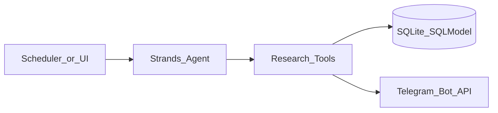

# PaperPulse — Strands AI Research Paper Agent

Weekly [Strands Agents](https://strandsagents.com/) research agent that scans the latest AI papers on [arXiv](https://arxiv.org), ranks them by your interests and citation traction, writes a short summary of each pick, stores digests in SQLite (SQLModel), and can send the result to **Telegram**.

## Features

- **Strands agent** — tool-using agent (`fetch → cite → rank → persist → Telegram`)
- **Interest keywords** — load topics via the UI, `data/interests.txt`, or `INTEREST_KEYWORDS`
- **Citation-aware ranking** — Semantic Scholar citation velocity + keyword match + recency
- **Weekly schedule** — APScheduler every Monday at 09:00 UTC (configurable)
- **Telegram digest** — notify `TELEGRAM_CHAT_ID` when a run completes
- **SQLModel + SQLite** — simple persistence
- **Vanilla HTML/JS UI** — track runs, mark read, save favorites

## Quick start

```bash
python3 -m venv .venv
source .venv/bin/activate
pip install -r requirements.txt
cp .env.example .env
# Set OPENAI_API_KEY for Strands LLM orchestration (recommended)
# Set TELEGRAM_BOT_TOKEN + TELEGRAM_CHAT_ID for weekly Telegram digests
python run.py
```

Open [http://localhost:8000](http://localhost:8000).

1. Add interest keywords in **Interests**
2. Click **Run research now**
3. When Telegram is configured, the digest is sent after the run finishes

Without `OPENAI_API_KEY`, the same Strands tools still run in a fixed deterministic order (dev/offline mode).

## Telegram setup

1. Message [@BotFather](https://t.me/BotFather) → `/newbot` → copy the token into `TELEGRAM_BOT_TOKEN`
2. Start a chat with your bot (or add it to a group)
3. Get your chat id (e.g. via `@userinfobot` or the Bot API `getUpdates`) → `TELEGRAM_CHAT_ID`

## How a run works



1. Load interests
2. Fetch arXiv candidates (interest query + recent category sweep)
3. Enrich with Semantic Scholar citations
4. Rank (keyword match, citation velocity, recency)
5. Summarize + persist top papers
6. Send Telegram digest (skipped if not configured)

## Configuration

| Variable | Purpose |
|---|---|
| `OPENAI_API_KEY` | Strands OpenAI model (recommended) |
| `OPENAI_MODEL` | Default `gpt-4o-mini` |
| `PAPERS_PER_RUN` | Max papers kept after ranking |
| `ARXIV_CATEGORIES` | arXiv categories |
| `INTEREST_KEYWORDS` / `INTERESTS_FILE` | Seed interests |
| `SEMANTICSCHOLAR_API_KEY` | Optional citation API key |
| `REQUIRE_KEYWORD_MATCH` | Drop non-matching papers |
| `TELEGRAM_BOT_TOKEN` / `TELEGRAM_CHAT_ID` | Digest notifications |
| `SCHEDULE_*` | Weekly cron |
| `DATABASE_URL` | Default SQLite file |

## API

- `GET /api/health` — health, next run, telegram/strands flags
- `GET|PUT /api/interests` — interest keywords
- `GET /api/runs` / `GET /api/runs/{id}` — research history
- `GET /api/papers` / `PATCH /api/papers/{id}` — tracking
- `POST /api/research/run` — start a Strands research run

## Tests

```bash
pytest -q
```

## Project layout

```
app/
  strands_agent.py     # Strands Agent entrypoint
  tools/research_tools.py  # @tool pipeline steps
  telegram.py          # Telegram Bot API helper
  agent.py             # Thin ResearchAgent facade
  models.py            # SQLModel tables
  arxiv_client.py / citations.py / ranking.py / interests.py / summarizer.py
  scheduler.py / main.py
  templates/ static/
data/interests.txt
```
