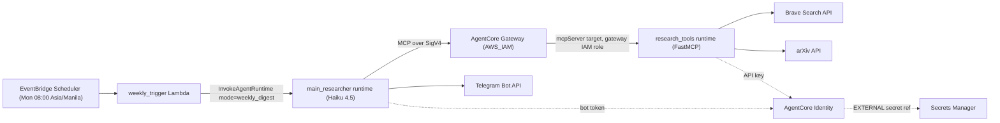

# Weekly AI Research Digest: Design

Status: implemented in code and unit tested, not deployed. You create the credentials and deploy by following the other guides in this folder. Section 6 records what was verified and what deviates from the original plan.

## 1. Goal and scope

Every Monday at 08:00 (Asia/Manila) the system researches the latest AI news and research,
builds a digest, and sends it to Carlo on Telegram.

- Research-heavy: arXiv papers come first, with a few news headlines.
- The same `main_researcher` agent can also be used interactively as a chat agent.
- In scope: application code, infrastructure-as-code, unit tests, setup docs.
- Out of scope: creating real secrets, credential providers or the Telegram bot, and running `agentcore deploy`.
  Those are manual steps documented in this folder.

## 2. Architecture

### Components

| Component | Location | Role |
| --- | --- | --- |
| EventBridge Scheduler | `agentcore/cdk/lib/cdk-stack.ts` | Fires `cron(0 8 ? * MON *)` in `Asia/Manila`. No scheduler retries. |
| `weekly_trigger` Lambda | `agentcore/cdk/lambda/weekly_trigger/handler.py` | Calls `InvokeAgentRuntime` with `{"mode": "weekly_digest"}`. Up to 2 attempts in code. |
| `main_researcher` runtime | `app/main_researcher/` | LangGraph ReAct agent on Claude Haiku 4.5. Runs the digest, then sends it to Telegram. |
| AgentCore Gateway | `agentcore/agentcore.json` (`research-gateway`) | Front door for tools (`protocolType: None`, `httpRuntime` target). Inbound auth `AWS_IAM`. |
| `research_tools` runtime | `app/research_tools/` | FastMCP server (MCP protocol) with `brave_news_search`, `brave_web_search`, `arxiv_search`. |
| AgentCore Identity | created by hand ([guide](secrets-and-agentcore-identity.md)) | API-key credential providers `brave-search-api-key` and `telegram-bot-token`. |
| Secrets Manager | (you create it) | Stores the raw secret values. Identity references them. |
| Telegram Bot API | external | Receives the final digest. |

### Sequence of a Monday run

1. EventBridge Scheduler fires at Monday 08:00 Manila time and invokes the `weekly_trigger` Lambda.
2. The Lambda calls `InvokeAgentRuntime` on `main_researcher` with `{"mode": "weekly_digest"}` and a fresh session ID.
3. `main_researcher` loads its MCP tools from the Gateway (requests signed with SigV4) and builds a Haiku 4.5 agent with the digest prompt.
4. The agent calls `arxiv_search` for each category and `brave_news_search` for headlines. Each call goes
   Gateway, then `research_tools`, then the external API. `research_tools` fetches the Brave key from AgentCore Identity.
5. The agent writes the digest as Telegram-safe HTML.
6. The entrypoint (plain code, not the LLM) fetches the bot token from AgentCore Identity and posts the digest
   to the chat, splitting messages longer than 4096 characters.
7. On any error the entrypoint sends a short "digest failed" notice to Telegram and re-raises, so the Lambda sees the failure.

## 3. Decision log

Each entry gives the choice, why, and what was rejected.

### D1. Trigger: EventBridge Scheduler, then a Lambda, then `InvokeAgentRuntime`
- Why: AgentCore runtimes only respond to invocations, so something must call them. Scheduler plus Lambda is
  debuggable and both pieces fit in the existing CDK stack.
- Rejected: Scheduler calling `InvokeAgentRuntime` directly as a universal target (fewer parts, but harder to debug and retry);
  an external cron such as GitHub Actions or Windows Task Scheduler; running only on the local machine.

### D2. Schedule: Monday 08:00, `Asia/Manila`
- Why: matches the user's morning. The scheduler supports an explicit time zone, so no UTC arithmetic.

### D3. Tools: a self-written FastMCP server
- Tools: `brave_news_search(query, freshness="pw", count)`, `brave_web_search(query, freshness="pw", count)`,
  `arxiv_search(query, categories, days_back=7, max_results)`.
- Why: the user asked for an MCP server that calls the public arXiv API and the Brave Search API.
- Rejected: plain native `@tool` functions (simpler, but not what was requested); third-party MCP servers.
  Dropped the fewer-tools variant (all three kept).

### D4. Hosting: separate MCP runtime behind an AgentCore Gateway
- Why: the user chose the Gateway option. It centralizes tool access and auth, and AgentCore Identity hands out keys per workload,
  so the Brave key is only visible to `research_tools`.
- Rejected: `main_researcher` calling the MCP runtime directly; bundling the server as a stdio subprocess.
  Also rejected as a target type: CLI-managed `mcpRuntimeTools` and Lambda targets (not a true self-written MCP server).

### D5. Auth: `AWS_IAM` inbound with SigV4
- `main_researcher` signs MCP requests with its execution role. The Gateway reaches the runtime with its own IAM role.
- Why: no Cognito user pool or client secrets to manage.
- Rejected: `CUSTOM_JWT` with Cognito (more moving parts); `NONE` (open gateway).
- Fallback: if IAM outbound auth to a runtime target is unsupported, use OAuth for that hop only (see section 5).

### D6. Secrets: Secrets Manager, referenced by AgentCore Identity (EXTERNAL)
- The raw Brave key and Telegram bot token live in Secrets Manager. API-key credential providers reference them
  (`--api-key-secret-source EXTERNAL`). Code fetches keys through Identity at runtime.
- The Telegram chat ID is not secret; it is passed as the `TELEGRAM_CHAT_ID` runtime env var.
- Rejected: plain environment variables for keys (less secure); Identity alone with the key stored inline.

### D7. Telegram is sent deterministically from the `main_researcher` entrypoint
- Why: guaranteed to happen every run and it keeps the bot token out of LLM reach. The Lambda stays a thin trigger.
- Rejected: a `send_telegram_message` tool the LLM may or may not call; sending from the Lambda.

### D8. Two modes with `dry_run`
- `{"mode": "weekly_digest", "dry_run": bool}` runs the digest. Any other payload is the normal chat flow with the same tools.
- `dry_run` returns the digest text without sending it, for local testing.
- Rejected: digest-only (loses the interactive agent).

### D9. Content: research-heavy, no deduplication
- arXiv categories: `cs.AI`, `cs.LG`, `cs.CL`, `cs.CV`, `cs.MA`, last 7 days. Papers are picked by the LLM on relevance alone.
- A few news headlines from Brave News with `freshness=pw` (past week).
- No cross-week memory; the 7-day window is enough.
- Rejected for now: AgentCore Memory deduplication, using Brave to measure which papers are being discussed, keyword filters.

### D10. Message format
- Telegram HTML parse mode. Layout: TL;DR (3 bullets), Notable Papers (5 to 8 with title, one-line "why it matters", arXiv link),
  Headlines (3 to 5 with links).
- Messages over 4096 characters are split on line boundaries.
- Rejected: short TL;DR only; long report in S3 with a Telegram summary.

### D11. Failure handling
- The entrypoint catches errors, sends a "digest failed: <reason>" notice, and re-raises.
- The Lambda makes up to 2 attempts. The Scheduler does not retry and the Lambda has async retries set to 0, so duplicates are avoided.
- Rejected: logs only; CloudWatch alarm with SNS email.

### D12. Model, region, target
- Model: Claude Haiku 4.5 through the global inference profile `global.anthropic.claude-haiku-4-5-20251001-v1:0`.
- Region `ap-southeast-1`, account `437024520945`, deployment target name `default`.

### D13. Cleanup
- Remove the `add_numbers` placeholder tool and the Exa MCP endpoint. Update the config bundle prompt and tool descriptions.

### D14. Testing
- pytest unit tests with HTTP mocked for the MCP tools, the Telegram sender and mode routing.
- Local run via the `dry_run` flag.

### D15. Docs location
- All docs live in `ResearchGroup/docs/`, next to the project README.

## 4. Future options (out of scope)

- AgentCore Memory to avoid repeating stories week to week.
- Using Brave to measure which papers are being discussed and rank them higher.
- A full report stored in S3 with a link in Telegram.
- CloudWatch alarm on Lambda errors with SNS email.

## 5. Open verifications (as planned)

- Haiku 4.5 global profile availability in `ap-southeast-1`.
- How a Gateway target references an MCP runtime, and whether IAM outbound auth to a runtime is supported.
- The name of the Gateway URL env var injected into runtimes.
- Whether the `agentcore` CLI supports EXTERNAL secret sources in `agentcore.json`.

## 6. Verification results

1. **Haiku 4.5 in `ap-southeast-1`: confirmed.** `aws bedrock list-inference-profiles --region ap-southeast-1` lists
   `global.anthropic.claude-haiku-4-5-20251001-v1:0` as `SYSTEM_DEFINED` and `ACTIVE`. Actual invocation access
   (model access in the account) is not tested here.
2. **Gateway to MCP runtime: implemented with an `httpRuntime` target and IAM.**
   - `@aws/agentcore-cdk` 0.1.0-alpha.54 restricts `mcpServer` targets to OAuth or no outbound auth, which would need a Cognito
     or OAuth setup. AWS docs agree for runtime targets reached through `mcpServer`
     ([gateway-vpc-egress](https://docs.aws.amazon.com/bedrock-agentcore/latest/devguide/gateway-vpc-egress.html)).
   - `httpRuntime` targets reference a runtime by name, default to `GATEWAY_IAM_ROLE`, and the construct grants the gateway
     role `bedrock-agentcore:InvokeAgentRuntime`. They require a gateway with `protocolType: "None"`, so the gateway is a
     thin HTTP front door and the MCP client sees the `research_tools` tools directly. The CLI's
     `agentcore invoke --gateway ... --gateway-target-name` supports this target type.
   - Consequence: the decision in D5 holds (IAM on both hops, no Cognito), with the detail that the gateway is
     `protocolType: "None"` and the target type is `httpRuntime`. Synthesis is covered by `test/weekly-digest.test.ts`.
     **Not verified against the live service**: whether the gateway forwards MCP traffic to an MCP-protocol runtime
     exactly as expected. If it does not, fall back to a gateway with the default MCP protocol and an `mcpServer`
     target using OAuth.
3. **Gateway URL env var: `AGENTCORE_GATEWAY_RESEARCH_GATEWAY_URL`.** Injected by `AgentCoreMcp` into every runtime
   (name uppercased, `-` to `_`); for `protocolType: "None"` it appends `/mcp`. The same construct sets
   `..._AUTH_TYPE` and grants `bedrock-agentcore:InvokeGateway` for `AWS_IAM` gateways. Asserted in the CDK test.
4. **EXTERNAL secret sources in `agentcore.json`: not supported.** The credential schema has only `name` and
   `authorizerType`. The AWS CLI/API does support `--api-key-secret-source EXTERNAL`, so the two providers
   (`brave-search-api-key`, `telegram-bot-token`) are created by hand ([guide](secrets-and-agentcore-identity.md)) and are
   deliberately not listed in `credentials`. The CDK stack adds the env vars and IAM instead.

### Deviations from the original plan

- Credentials are not declared in `agentcore.json` (see 4); `cdk-stack.ts` wires names and IAM.
- The Lambda passes `runtimeUserId`, because a SigV4-invoked runtime only receives a workload access token (needed for
  AgentCore Identity) when a user ID is present.
- `research_tools` runs under FastMCP, not `BedrockAgentCoreApp`, so it reads the workload access token from request
  headers itself. If the gateway hop does not deliver one, it falls back to Secrets Manager via the optional
  `BRAVE_SECRET_ARN` (set at deploy time; the stack grants read access). This fallback was not in the plan.
- `agentcore invoke '<json>'` wraps text as a prompt, so `main_researcher` also accepts a prompt that is a JSON digest request.
- The root `.gitignore` ignores `lib/`, which hid `agentcore/cdk/lib/`; an unignore line was added.

### Known risks (untested without deploying)

- Gateway forwarding of MCP traffic to the runtime (item 2).
- Whether AgentCore Identity delivers a workload access token to `research_tools` through the gateway; the Secrets Manager
  fallback exists for this.
- The exact service principal for the secret resource policy; the guide uses `bedrock-agentcore.amazonaws.com` and flags
  this for confirmation in the console.
- A digest with 60 abstracts plus news fits Haiku 4.5's context, but output quality and run time (a few minutes) are
  unmeasured until you do a real run.
