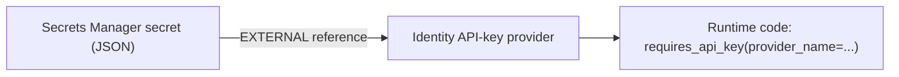

# Secrets Manager and AgentCore Identity setup

Goal: keep the Brave key and Telegram bot token in AWS Secrets Manager, and let AgentCore Identity reference them so
code fetches them at runtime without ever seeing a long-lived secret in config or environment variables.



Region for everything below: `ap-southeast-1`, account `437024520945`.

## Why the providers are created by hand

`agentcore.json` can declare an `ApiKeyCredentialProvider` by name only; the schema in this project has no field for a
Secrets Manager reference, and `agentcore add credential` takes the raw key with `--api-key`. To reference your own
secret, create the providers with the `bedrock-agentcore-control` API (below) before running `agentcore deploy`.
The CDK stack then grants the runtimes permission to use them and passes their names in environment variables
(`BRAVE_PROVIDER_NAME`, `TELEGRAM_PROVIDER_NAME`).

## Step 1: create the secrets

Use a file so the secret never lands in shell history. Each secret is JSON; the key name (`api_key`) is what the
provider reads.

```powershell
$region = "ap-southeast-1"

# Brave
$brave = Read-Host "Brave API key" -AsSecureString
$plain = [System.Net.NetworkCredential]::new("", $brave).Password
@{ api_key = $plain } | ConvertTo-Json -Compress | Set-Content -NoNewline brave-secret.json
aws secretsmanager create-secret --name agent-explore/brave-search-api-key `
  --secret-string file://brave-secret.json --region $region
Remove-Item brave-secret.json

# Telegram bot token
$tg = Read-Host "Telegram bot token" -AsSecureString
$plain = [System.Net.NetworkCredential]::new("", $tg).Password
@{ api_key = $plain } | ConvertTo-Json -Compress | Set-Content -NoNewline telegram-secret.json
aws secretsmanager create-secret --name agent-explore/telegram-bot-token `
  --secret-string file://telegram-secret.json --region $region
Remove-Item telegram-secret.json
```

Note each returned `ARN`. Secrets Manager appends a random suffix, so use the full ARN, for example
`arn:aws:secretsmanager:ap-southeast-1:437024520945:secret:agent-explore/brave-search-api-key-AbCdEf`
([create-secret examples](https://docs.aws.amazon.com/cli/latest/userguide/cli_secrets-manager_code_examples.html)).

## Step 2: let AgentCore Identity read the secrets

Per the AWS announcement, add a resource policy to each secret that lets the AgentCore Identity service principal call
`secretsmanager:GetSecretValue` (and `kms:Decrypt` on the key if you use a customer managed KMS key)
([blog post](https://aws.amazon.com/blogs/machine-learning/reference-your-own-aws-secrets-manager-secrets-in-amazon-bedrock-agentcore-identity/)).

The post does not print the principal name. The AgentCore service principal used elsewhere in the AWS docs is
`bedrock-agentcore.amazonaws.com` ([runtime security best practices](https://docs.aws.amazon.com/bedrock-agentcore/latest/devguide/runtime-security-best-practices.html)),
so the policy below uses it, scoped to your account. If the Identity console shows a different principal or a ready-made
policy snippet when you create a provider from a referenced secret, use that instead.

```json
{
  "Version": "2012-10-17",
  "Statement": [
    {
      "Sid": "AllowAgentCoreIdentityRead",
      "Effect": "Allow",
      "Principal": { "Service": "bedrock-agentcore.amazonaws.com" },
      "Action": "secretsmanager:GetSecretValue",
      "Resource": "*",
      "Condition": { "StringEquals": { "aws:SourceAccount": "437024520945" } }
    }
  ]
}
```

```powershell
aws secretsmanager put-resource-policy --secret-id agent-explore/brave-search-api-key `
  --resource-policy file://identity-read-policy.json --region ap-southeast-1
aws secretsmanager put-resource-policy --secret-id agent-explore/telegram-bot-token `
  --resource-policy file://identity-read-policy.json --region ap-southeast-1
```

## Step 3: create the credential providers

The names must be exactly `brave-search-api-key` and `telegram-bot-token` (the CDK stack and code use them).

```powershell
aws bedrock-agentcore-control create-api-key-credential-provider `
  --name brave-search-api-key `
  --api-key-secret-source EXTERNAL `
  --api-key-secret-config "secretId=<brave secret ARN>,jsonKey=api_key" `
  --region ap-southeast-1

aws bedrock-agentcore-control create-api-key-credential-provider `
  --name telegram-bot-token `
  --api-key-secret-source EXTERNAL `
  --api-key-secret-config "secretId=<telegram secret ARN>,jsonKey=api_key" `
  --region ap-southeast-1
```

This is the documented form ([Configure credential provider](https://docs.aws.amazon.com/bedrock-agentcore/latest/devguide/resource-providers.html)).
Verify with `aws bedrock-agentcore-control list-api-key-credential-providers --region ap-southeast-1`.

Rotation: update the secret value in Secrets Manager. AgentCore Identity reads the new value on its next read; no
redeploy is needed (same blog post).

## Step 4: IAM for the runtimes (done by the stack)

`agentcore/cdk/lib/cdk-stack.ts` adds, per runtime role: `bedrock-agentcore:GetWorkloadAccessToken*` on the workload
identity directory, and `bedrock-agentcore:GetResourceApiKey` on `token-vault/default` and
`token-vault/default/apikeycredentialprovider/<provider name>`. `main_researcher` can use only `telegram-bot-token`;
`research_tools` can use only `brave-search-api-key`. The policy shape follows the
[AgentCore harness security docs](https://docs.aws.amazon.com/bedrock-agentcore/latest/devguide/harness-security.html).

If a runtime returns an access-denied error when reading a key, compare its role policy with that page. The page also
lists a `secretsmanager:GetSecretValue` statement for Identity-managed secrets
(`bedrock-agentcore-identity!default/apikey/<name>-*`); that applies to secrets Identity creates itself, not the
referenced secrets used here.

## Why the Lambda sends a user ID

When a runtime is invoked with SigV4 (as the trigger Lambda does), AgentCore only issues a workload access token if the
request carries a user ID. The Lambda sets `runtimeUserId`; without it `requires_api_key` fails with
"Workload access token has not been set" (error text in the `bedrock_agentcore` SDK; see
[runtime OAuth docs](https://docs.aws.amazon.com/bedrock-agentcore/latest/devguide/runtime-oauth.html)).

Sources are listed in [sources.md](sources.md).
